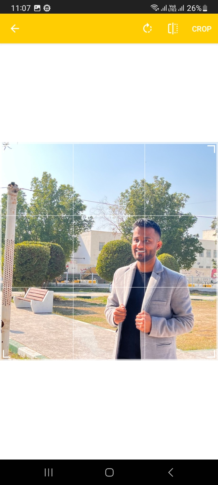

# Image Cropper Java

Simple android application to crop images [Download](https://github.com/theshoqanebi/image-cropper-java/releases/download/v1.0/app-release.apk)

built with gradle version `gradle-8.0-bin` and android gradle plugin version `8.1.1` and android studio version `Android Studio Giraffe | 2022.3.1 Patch 1`

|  |   |
| ---------------------------------------------- | -------------------------------------------- |

## License

This project is provided by [theshoqanebi](mailto:theshoqanebi@gmail.com) as open source software with the MIT license. See the [LICENSE](LICENSE) file for more information.
